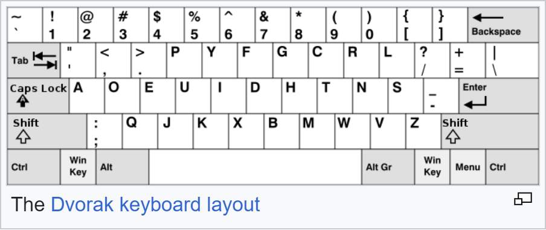

# Google Dyslexia: Write-up

Дана строка текста, набранного на сломанной клавиатуре:

```
gipa{c{aemcy{ydco{co{jgpo.e{tmm1ddki21jj
```

Известно, что флаги начинаются на `ugra_` и могут содержать подчёркивания как разделитель между словами. Строка начинается на `gipa{`, причём `{` встречается дальше в тексте ещё несколько раз. Похоже, что можно заменить однозначно заменить символы в строке, чтобы её «расшифровать». Но на что?

Гуглим нестандартные раскладки клавиатуры. Workman, Sholes, Colemak... Dvorak! Посмотрите, `{` расположена там, где в стандартной QWERTY находится подчёркивание. И остальные буквы бьются: `g` ↔ `u`,  `i` ↔ `r`, ... 



Осталось преобразовать. Простой способ — сделать это одним из множества онлайн-конвертеров (придумали же их зачем-то!).

Чуть менее простой — написать четыре строчки кода на том, что под руку попалось:
```haskell
import Data.List

qwerty = "-=qwertyuiop[]asdfghjkl;'zxcvbnm,./_+QWERTYUIOP{}ASDFGHJKL:\"ZXCVBNM<>?"
dvorak = "[]',.pyfgcrl/=aoeuidhtns-;qjkxbmwvz{}\"<>PYFGCRL?+AOEUIDHTNS_:QJKXBMWVZ"

antidvorak = map $ \c -> maybe c (qwerty !!) (elemIndex c dvorak)

antidvorak "gipa{c{aemcy{ydco{co{jgpo.e{tmm1ddki21jj"
```

Флаг: **ugra_i_admit_this_is_cursed_kmm1hhvg21cc**
