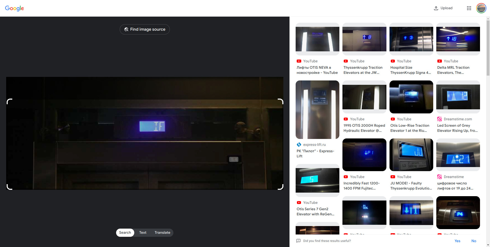
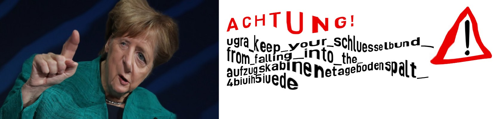

# IF: Write-up

Как нетрудно понять, даже не зная немецкого языка, на изображении табло лифта с показанием IF; это IF является сокращением, и нужно выбрать из списков слова, которыми оно образовано. Вариантов сильно больше, чем попыток — перебрать не получится. Придётся искать.

Искать сложно, потому что указать поисковой системе, что мы имеем в виду не английское слово «if», а аббревиатуру, никак не получается. Тем не менее, существует немало путей обнаружить расшифровку. Рассмотрим один из них.

## Собственно поиск

Зашлём изображение в поиск по картинкам, чтобы поискать похожие лифты и хотя бы понять, кто производитель.

Поиск работает сильно по-разному в зависимости от того, как обрезать картинку; захватывание в обрезаемую область дверей сильно повышает качество результатов — так поиск чётко понимает, что имеет дело именно с лифтом.

Смотрим внимательно на пропорции табло и расположение знаков: в частности, лифты КМЗ с квадратным табло, а также лифты Otis, где цифры ближе к середине, — не наши клиенты.

Однажды можно наткнуться, например, на [видео, где оператор издевается над лифтом ThyssenKrupp](https://www.youtube.com/watch?v=ysLW1PM9EDA); в какой-то момент лифт вместо этажа начинает показывать буквы JU. Они точно так же примыкают впритык к правому краю табло.

Что ж, это искать уже проще. Делаем запрос [["thyssenkrupp" "ju"](https://www.google.com/search?q=%22thyssenkrupp%22+%22ju%22)] — кавычки здесь означают, что нам действительно обязательно, чтобы в результатах было каждое слово в неизменном виде, и чтобы поисковая система не пыталась раньше времени умничать. Сразу находим [ещё один эпизод жестокого обращения с лифтами](https://www.youtube.com/watch?v=NDWbDMihePc), где в комментариях обсуждают показания JU и IF: комментаторы пишут, что JU — это Justierfahrt, а IF — Inspektionsfahrt.

> В русскоязычной терминологии эти режимы работы лифта называются _коррекцией_ и _ревизией_ соответственно.

Немецкий текст на странице ввода ответа можно понять с помощью машинного перевода. Он предписывает, если расшифровка сокращения оказалась сложным словом (каковых в немецком и правда немало), выбрать в двух списках его компоненты — то есть Inspektion и fahrt — по отдельности. (При этом слово Inspektionsfahrt целиком есть в списке на букву I; такой выбор тоже считался правильным.)

## Ввод ответа

На выбор предлагается 28646 слов на букву I и 106301 слово на букву F. Браузеры отображают такие длинные списки с некоторыми замедлениями в работе; на некоторых компьютерах может просто не хватить памяти, что приводит к аварийному завершению процесса. С этими трудностями можно справиться по-разному.

* **Поступить как обычный пользователь** и потерпеть; пользоваться страницей очень аккуратно, без лишних движений; попробовать несколько раз; открыть или установить альтернативный браузер и попытаться загрузить страницу в нём.
* **Выбрать ответ с клавиатуры**. Клавиша _Tab_ переключает элемент управления, находящийся в фокусе. Находящийся в фокусе раскрывающийся список (да, их корректно называть именно так) можно листать стрелками, клавишами _Page Up_ и _Page Down_; а можно прямо начать набирать буквы, и в списке выберется первый подходящий вариант. Важно сделать это быстро и без опечаток, иначе выберется что-нибудь не то, и придётся начинать сначала. По клавише _Enter_ ответ отправится на проверку.
* **Открыть страницу в браузере для терминала**, например, `lynx`. Хоть терминал и накладывает сильнейшие ограничения на отображение сайтов (картинку такой браузер, конечно, не покажет), простыми сайтами так вполне можно пользоваться. Большие списки совершенно не смущают этот браузер, он не тормозит. Правда, придётся управлять им с клавиатуры, как в предыдущем пункте.
* **Сформировать и отправить HTTP-запрос вручную**: прочитать код страницы, понять, куда форма отправляет запрос, как называются поля и какие у них должны быть значения, после чего выполнить запрос с помощью `curl` или каких-нибудь графических утилит. После того, как правильный ответ был однажды отправлен, на страницу `verify_result` можно заходить снова и снова.

Когда ответ введён, если это было сделано в пределах девяти попыток, отображается флаг.

В случае трудностей в прочтении флага можно обновить страницу — повторно вводить ответ не потребуется, но картинка будет сгенерирована заново с новыми искажениями, и на сложные места можно будет посмотреть свежим взглядом.

Флаг: **ugra_keep_your_schluesselbund_from_falling_into_the_aufzugskabinenetagebodenspalt_4biuih5iuede**

> **Немного об авторитетности источников**
> 
> При разработке задания было сделано много попыток найти какой-нибудь официальный документ или инструкцию от производителя (во всех трёх его инкарнациях — Thyssen, ThyssenKrupp и TKE), где было бы чётко написано, что IF — это именно Inspektionsfahrt. В [одном русскоязычном документе](https://www.scribd.com/document/661707455/Oshibki-Thyssen-3) (по номеру ["D6510-046"](https://www.google.com/search?q=%22D6510-046%22) можно найти куски других переводов; немецкая версия не обнаружилась) режим коррекции чётко называется Justierfahrt, а про ревизию говорится лишь то, что она Inspektion. При этом был найден [патент WO2017174692A1](https://patents.google.com/patent/WO2017174692A1/de) про устройство управления лифтом с кабины (Inspektionssteuerung), где слово Inspektionsfahrt упоминается очень много раз. За всё время поисков никаких альтернативных вариантов расшифровки обнаружено не было.
>
> Возможно, однажды желаемый авторитетный источник всё-таки найдётся.
