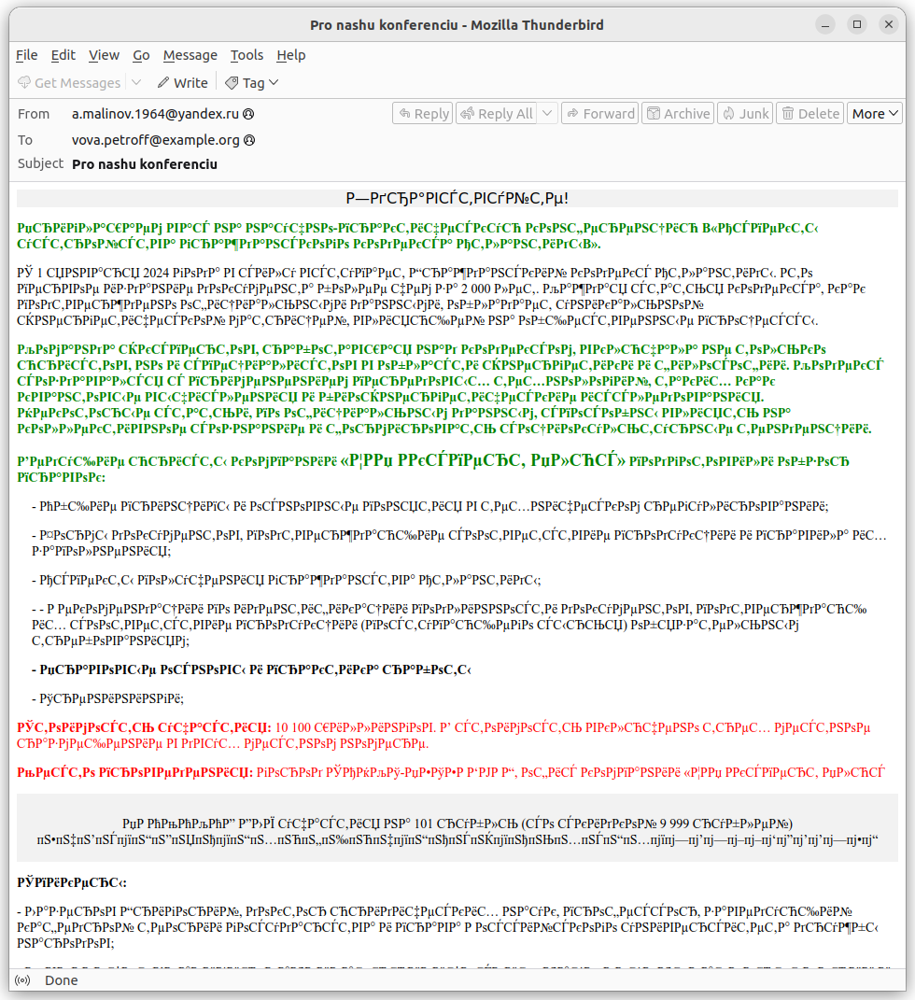
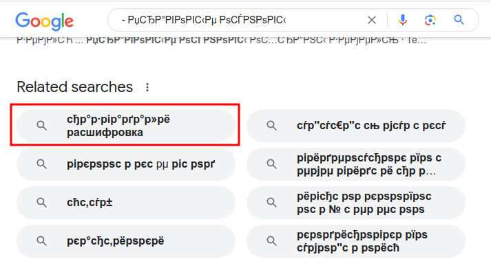

# Входящее письмо: Write-up

Скачиваем файл. Если он не откроется каким-нибудь уже установленным почтовым приложением компьютера (Microsoft Outlook, Thunderbird, …), можно поискать в интернете, что это за расширение `.eml` — так мы узнаем, что это письмо электронной почты.

Откроем файл в одном из подобных приложений: кроме перечисленных выше, нам подойдут Windows Live Mail, KMail и другие. Почтовый клиент покажет нам письмо с темой _Pro nashu konferenciu_ от пользователя `a.malinov.1964@yandex.ru`. Писать на этот ящик бесполезно — никто не ответит. Но это и не нужно, для начала стоит ознакомиться непосредственно с содержимым письма.

А с ним проблема: оно написано какими-то непонятными символами, и слова не разобрать. Видим где-то в тексте фотографии, номер телефона и почтовый ящик.

Если скопировать какой-нибудь фрагмент текста и поискать его в интернете, мы найдём очень много различных русскоязычных источников. Гугл даже сразу предлагает нам добавить слово «расшифровка»:

Если сделать такой запрос, найдётся уже чуть более полезная информация — на самом деле, такое явление широко известно под названием _кракозябры_.

Причина того, что мы не видим текст, в том, что в письме некорректно указана _кодировка_ — способ преобразования байтов файла в символы, отображаемых на экране. Текст написан в [UTF-8](https://ru.wikipedia.org/wiki/UTF-8) — многобайтовой кодировке, а отображается он в [Windows-1251](https://ru.wikipedia.org/wiki/Windows-1251) — однобайтовой кодировке для русского языка.

> Например, русская буква **А** имеет в Юникоде номер U+0410 (десятичное 1034, или 10000010000 в двоичной системе). В UTF-8 она представляется двумя байтами — D0 90, или, в двоичной записи, 110 **10000** ⋅ 10 **010000**. В то же время байт D0 в Windows-1251 обозначает букву **Р**, а 90 — символ **ђ**. Таким образом, вместо буквы **А** в письме будет отображаться комбинация **Рђ**. Все русские буквы в Юникоде стоят [рядом](https://www.unicode.org/charts/PDF/U0400.pdf), записываются в UTF-8 двумя байтами, и начало кода у них также **100** — получается, первый байт у всех них также D0 или D1. Отсюда и получается довольно большое количество букв **Р** в тексте.

Конвертировать каждую букву руками не надо — для этого существует множество декодеров. Они легко ищутся по запросу «декодировать кракозябры». Например, [этот](https://2cyr.com/decode/?lang=ru).

Можно указать кодировки вручную, но и автоматический режим вполне справится. Оказывается, что нас приглашают на конференцию по законодательству Атлантиды… Флаг указан на месте промокода. Он тоже написан какими-то странными буквами — но его легко можно перепечатать вручную и сдать.

Флаг: **ugra_stop_sending_spam_please_727661422753**
