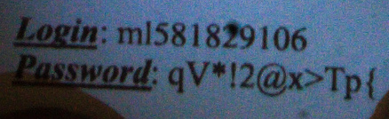
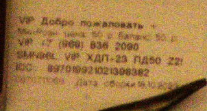
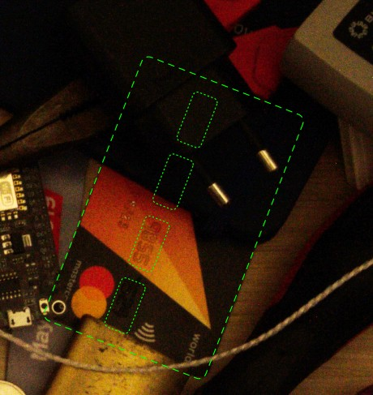
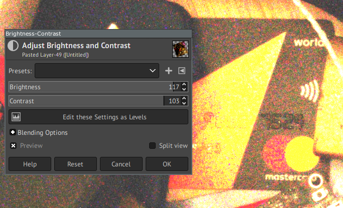
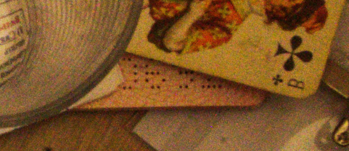
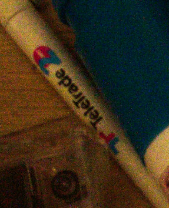
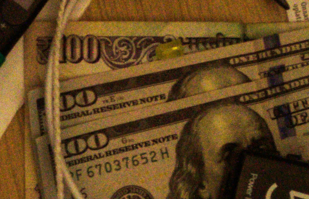
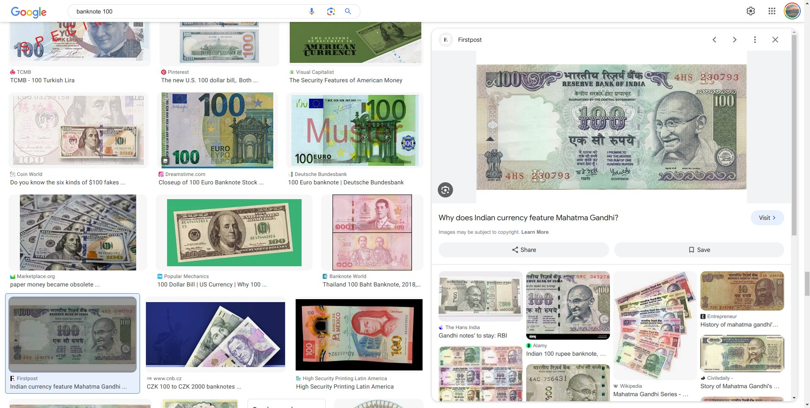
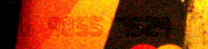

# Всё это как-то подозрительно: Write-up

Сайт спрашивает нас информацию, которую, как предполагается, можно узнать, изучая [изображение](attachments/IMG_5354.jpg).

В принципе, ответы на все эти вопросы можно правильно ввести с первой попытки, однако небольшой перебор вполне допустим — попытки не ограничиваются, но на каждую попытку требуется капча (настоящая reCAPTCHA, пытаться её обойти смысла нет).

## Логин и пароль

Тут всё просто: они есть прямо на той бумажке, за которой охотился наш персонаж. Бумажка подсвечена фонариком, чтобы наверняка. Следует обратить внимание на то, что буква `l` в логине более узкая, чем цифра `1`.

*Логин:* `ml581829106`

*Пароль:* `qV*!2@x>Tp{`

Откроем любой графический редактор (он всё равно понадобится) и подсветлим картинку, чтобы было удобнее изучать остальные её части.

## Номер телефона

На столе, в верхней части кадра, остался пластик из-под сим-карты с наклейкой с номером. Цифры 8, 6 и 9 похожи, но всё-таки отличаются друг от друга; зная, что первая цифра — 9, можно вглядеться и разобраться, что где.

*Номер телефона:* `+79688362090`

## Код подтверждения

Страница сама говорит — если код подтверждения неизвестен, можно ввести нули.

*Код подтверждения:* `000000`

## Последние цифры номера карты

В правой части кадра, чуть выше центра, видна банковская карта. Номер карты — 16 цифр — традиционно размещается группами по четыре чуть ниже центра; нас интересует последняя четвёрка.

Цифр совсем не видно — металлизация с карты стёрлась. Но их можно прочитать, если правильно подобрать контраст изображения:

*Последние цифры номера карты:* `7524`

## Последние цифры номера паспорта

Номер внутреннего паспорта не узнать — он лежит закрытый. Но на столе видно также маленький кусочек заграничного паспорта — слева, почти у края, возле стакана. Номер паспорта пробивается отверстиями внизу каждой страницы, и мы видим как раз последние четыре цифры — в отражённом виде, потому что смотрим на страницу с обратной стороны.

Развернём и отразим картинку для удобства.

С первыми цифрами понятно — это 06. Следующая цифра — 9: у тройки или пятёрки средняя точка правого столбца была бы свободна. Последняя цифра — 2: больше ни у одной цифры нижняя строка не заполнена целиком. При сомнениях можно поискать в интернете изображения загранпаспортов и сопоставить отверстия с эталонами.

*Последние цифры номера паспорта:* `0692`

## Работодатель

Это, конечно, не Агентство национальной безопасности США. В левом верхнем углу притаилась ручка с логотипом TeleTrade. Больше никаких предметов, намекающих на связь с какими-либо компаниями, на изображении нет, поэтому логично предположить, что именно TeleTrade является работодателем.

*Работодатель:* `TeleTrade`

## Страна последней заграничной поездки

Под долларовыми купюрами лежит ещё какая-то другая. Несмотря на верёвку и провод, чётко виден номинал — 100 единиц.

Поищем в интернете картинки по запросу [[banknote 100](https://www.google.com/search?q=banknote+100&tbm=isch)] и будем искать такие, где орнамент сверху похож на наш. Через пару минут найдём изображение 100 индийских рупий (образца 1996 года).

Логично предположить, что купюра была привезена из Индии.

*Страна последней заграничной поездки:* `India`

## Полный номер карты

Мы уже знаем конец номера: 9855 7524. Поиграв с контрастом, захватим также стоящую перед ними цифру 6:

Номера банковских карт Visa, MasterCard и некоторых других систем устроены так:
* Первые шесть цифр (BIN — bank identification number) обозначают платёжную систему, банк, тип карты (кредитная или дебетовая), а также категорию карты (Classic, Gold, Platinum и так далее). Узнать закреплённые за банком BIN можно поиском в интернете; у похожих карт одного банка будет или одинаковый BIN, или один из нескольких.
* Следующие девять — идентификатор клиента внутри банка, выбирается банком на его усмотрение. Как правило, эти цифры последовательны или случайны.
* Последняя цифра — контрольная, вычисляемая [алгоритмом Лу́на](https://ru.wikipedia.org/wiki/Алгоритм_Луна).

Названия банка мы не видим, но можем заслать видимую половинку карты в поиск по изображениям (Яндекс справляется существенно лучше, чем Гугл) и обнаружить, что карту выпустил Рокетбанк. Там же, в поиске по картинкам, видим много других карт MasterCard Рокетбанка — у всех них номера начинаются с 532130.

Осталось подобрать седьмую цифру. Открываем [первый попавшийся чекер алгоритма Луна](https://www.dcode.fr/luhn-algorithm) и перебираем все варианты. На цифре 4 контрольная сумма сходится.

*Полный номер карты:* `5321304698557524`

---

Ответив на последний вопрос, мы попадаем на страницу с уведомлениями, одно из которых содержит флаг.

Флаг: **ugra_sometimes_you_just_narrowly_escape_and_win_atkw6etn9kj1**
