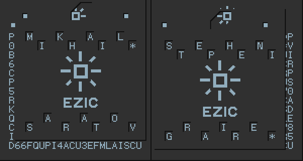

# Посланник: Write-up

Сгенерировалась вот такая картинка.

Вид шифровки, текст легенды, да и само название задания отсылают к игре Papers, Please. Игрок играет за инспектора пограничного контроля тоталитарной страны Арстоцки, проверяя документы и решая, впускать или не впускать каждого человека; при этом он оказывается впутан в различные сюжетные линии, а от его решений зависят судьбы людей и даже целых территорий. Одна из линий — деятельность тайного Ордена Звезды EZIC, стремящегося свергнуть правительство Арстоцки; агенты Ордена предлагают игроку различные предметы, в том числе аналогичную шифровку.

Независимо от того, была ли узнана отсылка к игре или нет, шифровку полезно целиком направить в поиск по картинкам. Первый же результат — [страница EZIC с Papers Please Wiki](https://papersplease.fandom.com/wiki/EZIC). На ней в деталях описаны действия агентов Ордена и указано, как пользоваться шифровкой: саму по себе её разгадать невозможно, надо дождаться, пока Орден доставит трафарет. Изображение трафарета есть на странице.

В игре, наложив трафарет так, чтобы верхние отверстия совпадали с точками в верхней части шифровки, можно прочитать имена двух агентов.

[Вот так это выглядит в игре](https://www.youtube.com/watch?v=rjQ6nBEqMFM&t=95s).

В нашем же случае мы можем прочитать две части флага.

Вместо звёздочек следует вводить подчёркивания, поскольку никакие другие разделители форматом флага не допускаются.

Флаг: **ugra_[snowier_pastures](https://papersplease.fandom.com/wiki/Obristan)_8dbzhtp4**
