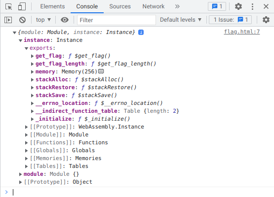
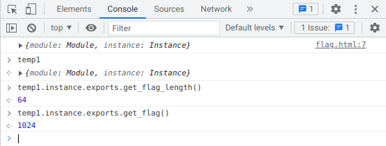

# Раз, два, взяли: Write-up

Дан непонятный файл без расширения. 

```bash
$ file flag.\?\?\?
flag.???: WebAssembly (wasm) binary module version 0x1 (MVP)
```

WebAssembly (wasm) — формат, разработанный для возможности исполнять производительные компилируемые программы в браузере. Модули могут быть представлены в бинарном или текстовом виде; с точки зрения возможностей исполнения эти представления эквивалентны.

В [документации](https://developer.mozilla.org/ru/docs/WebAssembly/Loading_and_running) описаны разные способы запустить код в браузере.

Создадим отдельную директорию, переименуем `flag.???` в `flag.wasm` и попробуем его загрузить, создав `flag.html` следующего содержания — скопируем пример из документации, чуть видоизменив:

```html
<body>
    <script>
        fetch('flag.wasm')
            .then(response => response.arrayBuffer())
            .then(bytes => WebAssembly.instantiate(bytes, {}))
            .then(result => {
                console.log(result);
            });
    </script>
```

Чтобы `fetch` отработал как надо, смотреть страницу надо через веб-сервер. Запустим тестовый веб-сервер прямо в этой директории:

```bash
$ python3 -m http.server
```

Откроем нашу страничку (`http://localhost:8000/flag.html`). В консоли действительно появился некий Object. В документации дальше написано, что предоставляемые нашим модулем функции лежат внутри `instance.exports`:



Нажмём правой кнопкой на Object и сохраним его как переменную `temp1`, чтобы вызвать его функции, интересующие нас — `get_flag_length` и `get_flag`:



С длиной 64 всё понятно, а вот возвращаемое вместо флага число 1024 (ещё и вычисленное далеко не сразу, за пару десятков секунд) вызывает некоторое недоумение. Как [можно выяснить](https://stackoverflow.com/questions/41353389/how-can-i-return-a-javascript-string-from-a-webassembly-function), WebAssembly в чистом виде как таковые строки не поддерживает: для передачи каких-либо данных сложнее простых одиночных значений нужно пользоваться указателями. 1024 — адрес во внутренней памяти модуля; в объекте модуля действительно легко обнаружить `memory`. Как написано в ответе на StackOverflow, чтобы работать с ним, надо преобразовать его в `Uint8Array`.

Оставаясь в консоли, достанем из памяти 64 байта:

```javascript
let a = new Uint8Array(temp1.instance.exports.memory.buffer);
let s = "";
for (let i = 1024; i < 1024 + 64; ++i) {
    s += String.fromCharCode(a[i]);
}
console.log(s);
```

Флаг: **ugra_those_are_basically_all_the_possibilities_of_wasm_i7kgnsrwg**
