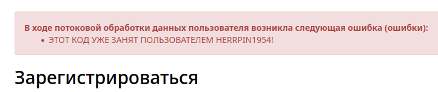

# На старой железяке…: Write-up

Видим красочный сайт ЦСДО «От винта», безуспешно пытаемся войти или зарегистрироваться. Но замечаем, что при регистрации выводятся достаточно любопытные сообщения об ошибках.


Попробовав разные пин-коды, понимаем, что есть два рода ошибок:

- в чужом пин-коде присутствует цифра из нашего кода;
- в чужом пин-коде есть цифра из нашего кода на той же позиции.

Это же [«Быки и коровы!».](https://ru.wikipedia.org/wiki/%D0%91%D1%8B%D0%BA%D0%B8_%D0%B8_%D0%BA%D0%BE%D1%80%D0%BE%D0%B2%D1%8B) Но с некоторыми ограничениями:

- за раз нам дают не больше двух сообщений о быках и коровах;
- бык также содержит позицию цифры;
- стратегия «заслать шесть одинаковых цифр» не работает: если цифра встречается больше двух раз подряд, возникает ошибка.

> «Быки и коровы» — классическая игра на логику. Один игрок загадывает число, а другой его угадывает. Загадавший после каждой попытки называет угадывающему число «коров» и «быков» — совпадений по цифрам без учёта позиции и с учётом позиции соответственно.

Брутфорс без особой оптимизации позволит получить пароль за ~730 запросов: 10 на то, чтобы угадать набор цифр в пин-коде, и $6!$ — чтобы перебрать все перестановки из известных цифр.

С особой оптимизацией можно поступить так: из ошибок следует, что все цифры в угадываемом пин-коде уникальные.

Чтобы угадать набор цифр, возьмём все наборы пин-кодов из уникальных цифр:
```python
import itertools
prod = itertools.product('0123456789', repeat=6)
combs = [''.join(x) for x in prod if len(set(x)) == len(x)]
```

И собирать коров с быками по ответам сервера. Притом, поскольку приоритетная задача — сперва собрать набор цифр, будем пропускать все комбинации из `combs`, в которых уже есть известные нам цифры.

Удобно также предварительно завести функцию, которая подключается к серверу, проверяет пин-код и возвращает ошибки. Не забывая про то, что на сайте предусмотрен рейт-лимит: 1 запрос в секунду.

```python
import requests
import time
from bs4 import BeautifulSoup

URL = f"https://pinique.ctf.test-playground.win/{TOKEN}/"
session = requests.Session()


def try_pin(pin):
    response = session.post(URL + "register", {
        "username": "x",
        "pin": pin
    })
    if response.status_code == 200:
        html = BeautifulSoup(response.text)
        results = html.find("ul").text.strip().split('\n')
        return results
    else:
        time.sleep(1)
        return try_pin(pin)
```

Перебираем:

```python
cows = set()
bulls = {}
just_bulls = set()
iters = 0

for pin in combs:
    if set(pin) & (cows | just_bulls):
        continue
    response = try_pin(pin)
    iters += 1
    print(cows | just_bulls)
    for msg in response:
        if 'ПОПУЛЯРНА' in msg:
            words = msg.split()
            cows.add(words[1])
        elif 'НА ПОЗИЦИИ' in msg:
            words = msg.split()
            just_bulls.add(words[1])
            bulls[words[1]] = int(words[4])
    if len(cows | (just_bulls - cows)) == 6:
        print('подобрали все символы, пора угадывать перестановку')
        break

print(cows | just_bulls)
print('ходов', iters)
```
Этот код позволит собрать все символы за три хода.

Теперь угадаем перестановку. Сгенерируем список всех перестановок из найденного набора цифр:

```python
alphabet = just_bulls | cows
perms = [''.join(x) for x in itertools.permutations(''.join('1234567890'), 6)]
```

Применим две хитрости. Поскольку сообщений за раз приходит всего два, чтобы повысить шанс, что мы узнаем из них что-то новое, будем скрывать во всех перестановках уже известных нам быков. Их можно заменить на цифры, которых заведомо нет в пин-коде.

```python
def mask_bulls(x):
    y = list(x)
    not_cows = list(set('0123456789') - (just_bulls | cows))
    i = 0
    for bull, pos in bulls.items():
        if x[pos] == bull:
            y[pos] = not_cows[i]
            i = (i + 1) % len(not_cows)
    return ''.join(y)
```

Начнём поиск:

```python
alphabet = just_bulls | cows
iters = 0

for pin in perms:
    if len(bulls) > 4:
        print('нашли 5 позиций, последняя очевидна')
        break
    masked_pin = mask_bulls(pin)
    response = try_pin(masked_pin)
    print(just_bulls, masked_pin, response)
    iters += 1
    for msg in response:
        if 'ПОПУЛЯРНА' in msg:
            random.shuffle(perms)
        elif 'НА ПОЗИЦИИ' in msg:
            words = msg.split()
            just_bulls.add(words[1])
            bulls[words[1]] = int(words[4])
        elif not 'НЕДОСТУПНА' in msg:
            print(msg)
            break
    
print('ходов:', iters)

```

Остановимся, когда соберём пять быков, поскольку шестой тогда найти сможем сами. Вот так, например:

```python
result = [None] * 6
for bull, pos in bulls.items():
        result[pos] = bull
for i, x in enumerate(result):
    if x is None:
        result[i] = [*cows - just_bulls][0]
    
print(''.join(result))
```

Получим пин. Введём его в форму регистрации. Обнаружим очередной сюрприз:



И, действительно, вся жизнь твоя изменится, [когда ты подберёшь!](https://www.youtube.com/watch?v=3HPnT9D7dnI)

Получив _тот самый пин-код_, входим на сайт. Читаем личное письмо от самого господина Пина, получаем промокод — флаг.

Флаг: **ugra_your_life_will_change_as_you_figure_out_that_3wfhdpq2z8sl**

---

> **Постмортем**  
> 
> В таск закралась неочевидная логическая ошибка. По задумке, если в попытке встречается больше двух одинаковых цифр, сайт не должен был отображать никаких сообщений о быках и коровах. 
>
> Это было нужно, чтобы исключить перебор вручную методом: `000001», 000010, 000100, …`. Однако, если повторялись цифры, которых нет в пин-коде господина Пина, условие на сайте не срабатывало, и сообщения о быках и коровах отображались нормально. 
>
> В ряде случаев это упрощало решение настолько, что пин-код можно было подобрать вручную за 5-10 попыток.