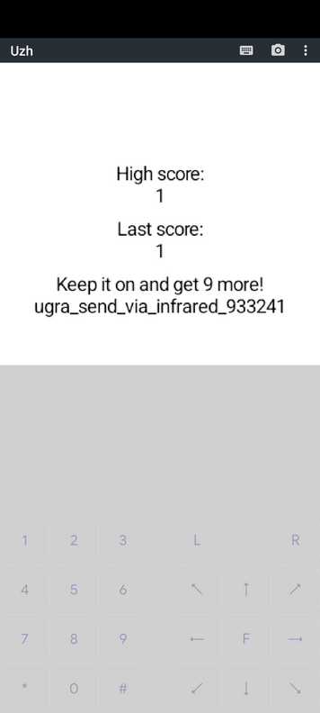

# Уж: Write-up

Скачиваем с борды JAR-файл. Попробуем его запустить обычной Java:

```
$ java -jar Uzh.jar
no main manifest attribute, in Uzh.jar
```

Оказывается, что в этом файле нет main-класса, и JVM не знает, что запустить. Нам предлагают заглянуть в *манифест*, давайте это и сделаем.

На самом деле, JAR — это просто ZIP-архив, содержащий скомпилированные классы, ресурсы и манифест. Именно его использует JVM, чтобы понять, что нужно запускать.

Распакуем JAR, внутри видим некие файлы `.class` — это собственно само приложение, и файл `MANIFEST.MF`. Откроем его:

```
Manifest-Version: 1.0
Ant-Version: Apache Ant 1.7.1
Created-By: 20.45-b01 (Sun Microsystems Inc.)
MIDlet-1: UzhMIDlet,,org.ugra.uzh.UzhMIDlet
MIDlet-Vendor: Vendor
MIDlet-Name: Uzh
MIDlet-Version: 1.0
MicroEdition-Configuration: CLDC-1.0
MicroEdition-Profile: MIDP-2.0
```

Наше внимание привлекает обилие слов MIDlet. Нетрудно найти в интернете, что оно [означает](https://ru.wikipedia.org/wiki/%D0%9C%D0%B8%D0%B4%D0%BB%D0%B5%D1%82) — это мобильное приложение для платформы Java ME.

Открываем дедушкин шкаф и ищем там телефон из середины нулевых — скорее всего это то, что нужно. А если такого нет, то нетрудно найти и эмулятор J2ME под нужную платформу. Например, для Android подойдёт [J2ME Loader](https://play.google.com/store/apps/details?id=ru.playsoftware.j2meloader&hl=ru).

Открываем, вводим наш пин-код и видим змейку (а, точнее, ужа). Собираем хотя бы одно очко и получаем флаг.



Флаг: **ugra_send_via_infrared_933241**
