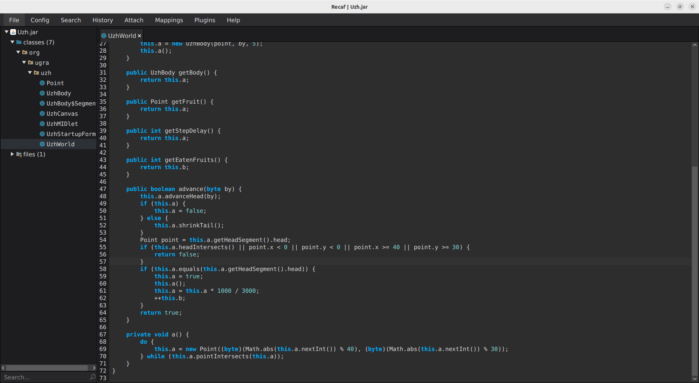
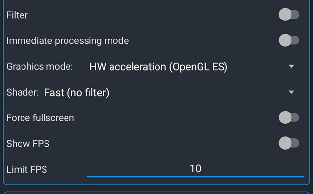

# Уж 2: Write-up

> Сначала прочитайте [райтап](../uzh/WRITEUP.md) к первой части.

После первого поражения нам говорят, что нужно набрать 10 очков для получения второго флага. Может показаться, что с такой медленной змейкой проблема будет лишь в потраченном времени. Однако всё не так просто: яблоки-то не простые. После каждого яблока скорость ужа увеличивается втрое. Второе и третье яблоко собираются легко, а дальше уже начинаются проблемы.

Наша задача — придумать чит для замедления змейки. Есть несколько способов это сделать:

## Способ 1. Запатчить

Воспользуемся каким-нибудь декомпилятором, чтобы узнать, что же происходит внутри ужа. Можно воспользоваться любым — покажем на примере [Recaf](https://www.coley.software/Recaf/).

Откроем наш JAR-файл в нём. Классов в нём немного, можно прочитать все. Рано или поздно мы наткнёмся на класс `UzhWorld`  метод `advance`, который манипулирует некой переменной `a`, изначально равной 400, и меняет её при каждом вызове на значение `1000 / 3000`.

Единственное место, где этот метод вызывается — главный метод `UzhCanvas::run`. Учитывая то, что именно там проверяется съедение 10 фруктов, логично предположить, что эта функция и отвечает за обработку фрукта, а указанные числа — это коэффициенты изменения скорости.

Пропатчим класс — заменим 3000 на 1000: тогда скорость меняться не будет. Заодно можно и ускорить игру — до разумных пределов, чтобы пройти быстрее: изменим начальное значение 400 на что-то поменьше.

> *— Точно уменьшить?*
>
> В [оригинале](../uzh/client/src/org/ugra/uzh/UzhWorld.java#L15) можно увидеть изначальные названия констант, которые не попали в собранный файл. 400 — это временной интервал между перемещениями ужа. Понять это можно было, например, заметив, что это значение именно **уменьшается** при каждом поедании.

Обратите внимание, что `a = 400` — локальная переменная. Чтобы запатчить её значение, нужно смотреть в конструктор класса.

В том же Recaf можно запатчить инструкции, нажав правой кнопкой мыши и выбрав Edit assembler.

Исправив все числа, сохраняем приложение и открываем заново. И вот, когда наша змейка уже двигается с постоянной скоростью, с лёгкостью получаем флаг.

## Способ 2. Ограничить FPS

Игра так написана, что уж перемещается только при новой отрисовке экрана. Нет отрисовок — нет движения. При этом если за время обновления экрана уж должен был проползти несколько клеток, то на самом деле этого не произойдёт — при `repaint` происходит всегда ровно одно движение.

Поэтому можно просто встроенными средствами эмулятора — если ваш такое поддерживает — ограничить скорость змейки. Например, в уже упомянутом J2ME Loader это делается в настройках приложения:

## Способ 3. Просто выиграть

В некоторых эмуляторах, видимо, FPS ограничен из коробки — поэтому можно было попросту выиграть. Попробуйте — вдруг у вас получится.

Флаг: **ugra_it_gets_longer_c34d4f**
