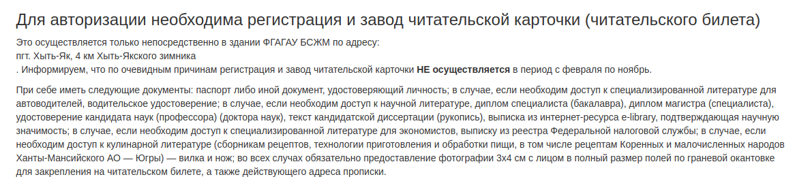
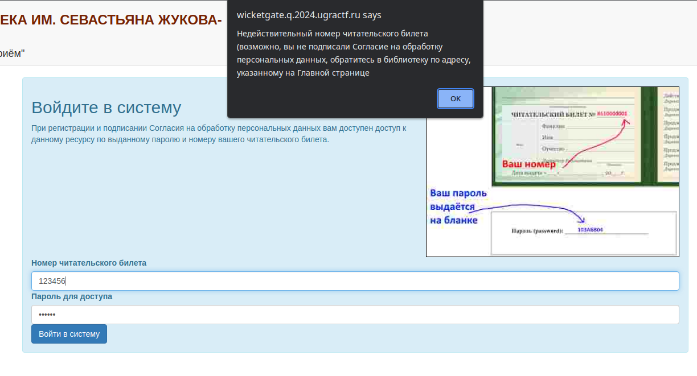
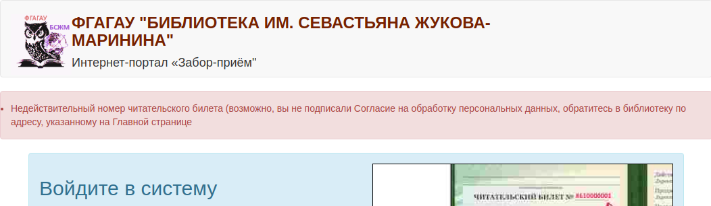
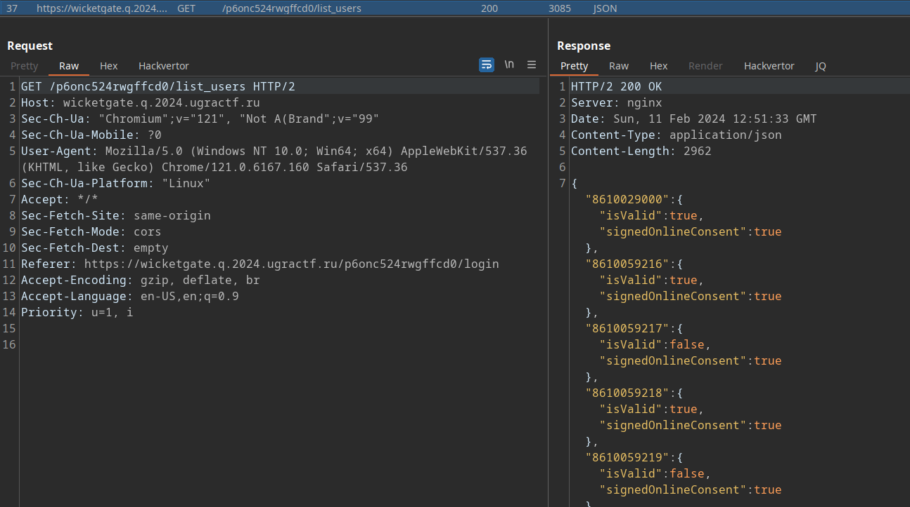
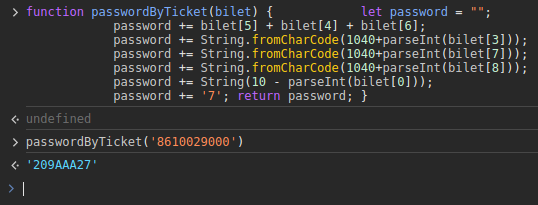
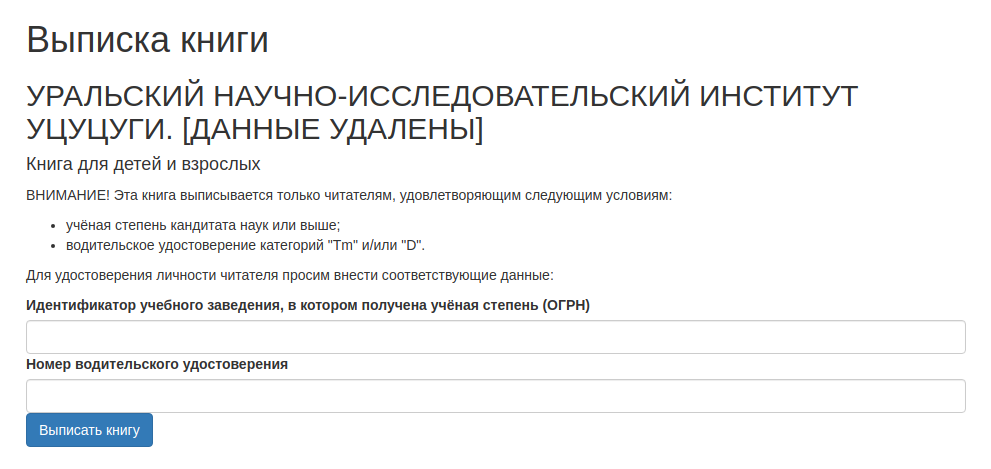
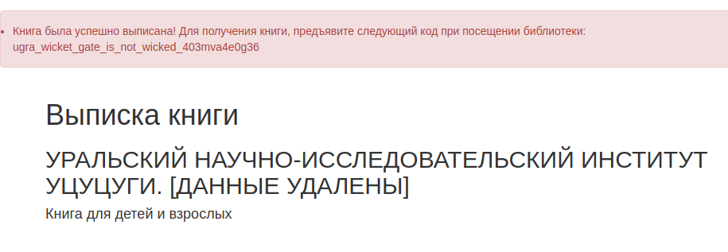

# Калитка: Write-up

Нас встречает сайт местной библиотеки, на котором также крайне подробно описываются требования к регистрации и получению читательского билета. 



Так как ехать в Хыть-Як у нас нет ни возможности, ни, скорее всего, желания, попробуем войти в систему.



При попытке входа в систему появляется сообщение об ошибке, что номер читательского билета недействителен. Так как оно представлено в виде модального окна, попробуем изучить JS-код странички, чтобы разобраться, что его вызывает.

Открыв веб-инспектор, видим, что в одном из элементов `<script>` к форме привязывается обработчик событий `onsubmit`, который предотвращает отправку формы на сервер, если результат выполнения функции `ValidateCredentials()` не равен `true`. 

```javascript
document.getElementById("loginForm").addEventListener("submit", async function(event) {
    event.preventDefault();
    if (await validateCredentials()){
            this.submit();
    }
    else{
        alert("<текст ошибки>");
    }
});
```

Мы можем попробовать обойти эту проверку, отправив из консоли разработчика форму напрямую, либо из неё же переопределив функцию `validateCredentials()`, либо выполнив POST-запрос напрямую любым удобным способом:

```javascript
> document.getElementById('loginForm').submit()
// или
> validateCredentials = () => { return true; } // и нажать «Войти»
```



На сервере тоже есть проверка учётных данных. Будем разбираться дальше и смотреть, что происходит в функции `validateCredentials()`, используемой на клиенте.

```javascript
async function validateCredentials() {
    var chitateli = await fetch('/{{token}}/list_users').then(response => {
        return response.json();
        }).catch(err => {
        console.log(err);
        })
    var bilet = document.getElementById('bilet').value;
    var reader_password = document.getElementById('password').value;
    if (bilet in chitateli){
        if (chitateli[bilet].isValid == true && chitateli[bilet].signedOnlineConsent == true){
            let password = "";
            password += bilet[5] + bilet[4] + bilet[6];
            password += String.fromCharCode(1040+parseInt(bilet[3]));
            password += String.fromCharCode(1040+parseInt(bilet[7]));
            password += String.fromCharCode(1040+parseInt(bilet[8]));
            password += String(10 - parseInt(bilet[0]));
            password += '7'
            if (password.match(/[0-9]{3}[А-Я]{3}[0-9]{2}/) && password == reader_password){
                return true;
            }
        }
    }
    return false;
}
```

…Да. Библиотека настолько перестаралась с аутентификацией пользователей, что осуществляет её и на сервере, и на клиенте.

В первой строчке видим, что скрипт забирает список читателей с сервера. Можем обратиться к этому списку сами и посмотреть, что он из себя представляет.



Это большой JSON-объект, в котором хранятся номера читательских билетов. Также у каждого из билетов есть свойства — является ли билет действительным, и подписал ли читатель согласие на обработку персональных данных.

Видим, что далее в функции проверяется, входит ли введённый билет в список существующих, а также те самые свойства. Значит, нам нужен любой из билетов, у которого оба свойства равны `true`. В списке из скриншота таковым является первый же билет, `8610029000`, его и возьмём.

Далее начинается проверка пароля. Как по коду, так и по иллюстрации на странице входа видно, что пароль представляется собой последовательность из трёх цифр, трёх заглавных букв русского алфавита и ещё двух цифр. Но занимательнее другое — этот пароль генерируется прямо из номера читательского билета весьма своеобразным алгоритмом.

Разбираться в нём абсолютно необязательно, достаточно применить его для выбранного нами номера билета.



Теперь мы можем зайти в библиотеку с требуемыми номером билета и паролем.

> На самом деле на сервере проверялся только номер билета. Получив его, можно было отправить форму с подходящим билетом и произвольным паролем любым из ранее описанных способов.

Теперь мы имеем доступ к каталогу книг, имеющихся в библиотеке. Большинство из них розданы другим читателям, но одно научное издание всё ещё можно выписать:



Но для получения книги нужно заполнить форму авторизации, которая также сообщает в модальном окне об ошибке подтверждения личности читателя. Идём смотреть обработчик:

```javascript
document.getElementById("orderForm").addEventListener("submit", function(event) {
    event.preventDefault();
    if (ReaderCheck()){
            this.submit();
    }
    else{
        alert("Не подтверждена личность читателя!");
    }
});                     

function ReaderCheck() {
    var vuz_id = document.getElementById('vuz_id').value;
    if (!vuz_id.match(/^[0-9]{13}$/)){
        return false;
    }   
    var driver_id = document.getElementById('driver_id').value;
    if (!driver_id.match(/^[0-9]{2}\s[0-9]{2}\s[0-9]{6}$/)){
        return false;
    }
}
```

Проверка данных, введённых в форму, более простая чем при входе в библиотеку, но есть другой момент — она никогда не возвращает `true`. Обходим её так же, как мы начинали обходить форму аутентифкации:

```javascript
> document.getElementById('orderForm').submit();
// или
> ReaderCheck = () => { return true; } // и нажать «Выписать книгу»
```



Флаг: **ugra_wicket_gate_is_not_wicked_403mva4e0g36**
