# Языковой барьер: Write-up

Видим сайт макаронной фабрики, а внизу — кнопку для перевода главной страницы на другие языки. Разберёмся, как она работает.

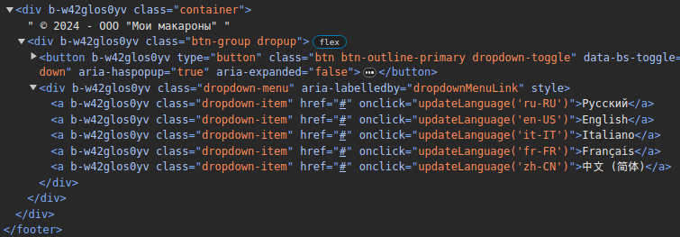

При нажатии на один из языков вызывается JS-функция `updateLanguage()`, которая и отвечает за обновление контента страницы. Рассмотрим её код:

```javascript
function updateLanguage(lang){
    fetch(`${window.location.pathname}localization/`, {
        method: 'GET',
        headers:{
            'Accept-Language': lang
        }
    }).then(
        response => response.text()
    ).then(
        response => document.getElementById('home-page').innerHTML = response
    ).catch(
        err => console.error(err)
    )
}
```

Код языка передаётся в переменной `lang`, после чего подставляется в заголовок `Accept-Language` GET-запроса к маршруту `/<token>/localization`, который и возвращает переведённые версии главной страницы.

Посмотрим, что произойдёт, если в такой запрос подставить произвольное значение:

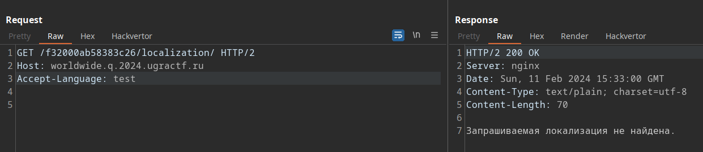

Логичным будет предположение о том, что значение заголовка является параметром, потенциально используемым для поиска в базе данных. Подставим кавычку в конец параметром и получим сообщение об ошибке:

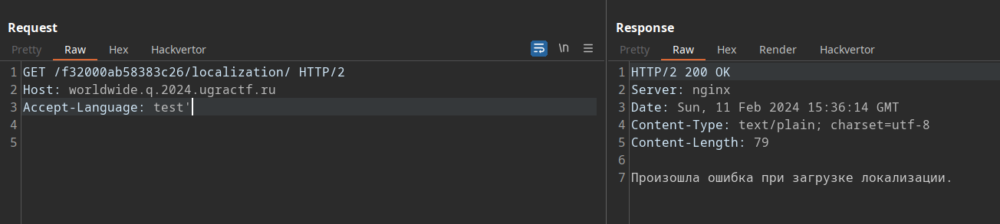

А если добавить ещё и SQL-комментарий — получим предыдущее сообщение о том, что локализация не найдена, а значит, сам запрос выполнился успешно, но поиск в БД ничего не вернул.

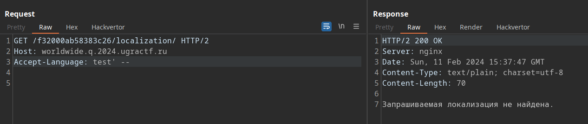

Эти признаки указывают, что здесь возможна SQL-инъекция. Попробуем использовать стандартную технику с применением операции UNION — но вне зависимости от значения параметра мы получаем ошибку.

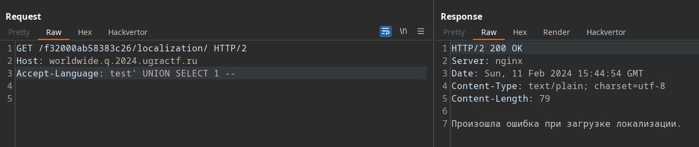

Наиболее вероятные причины ошибки — несоответствие типов данных и количества столбцов, указываемых во втором запросе. Перебрав различные варианты, выясняем, что для получения какого-либо вывода из БД нужно указать два столбца строкового типа, причём выведется только второй:

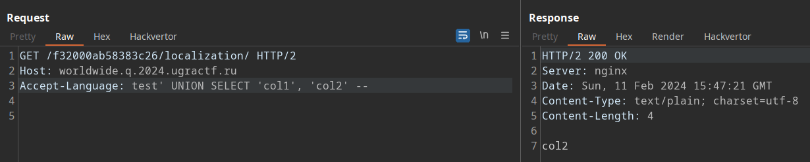

Для начала осмотримся и узнаем, в какой именно базе данных мы находимся. Перебрав различные функции для вызова информации о СУБД, выясняем, что это PostgreSQL.

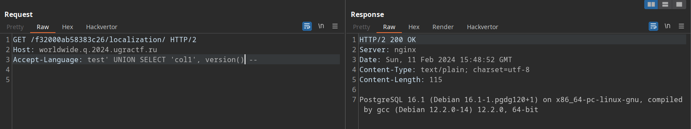

Теперь нам нужно узнать, какие ещё таблицы существуют в БД, ведь, кроме главной страницы, на сайте есть ещё и форма логина, а значит, в базе могут храниться учётные данные для входа. Для этого обратимся к `information_schema.tables` — таблице, содержащей информацию обо всех таблицах в БД. 

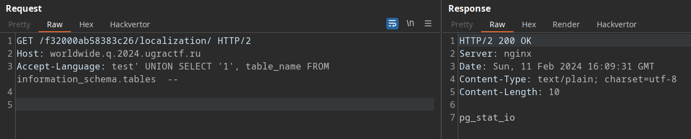

Приложение возвращает только первую строку из таблицы с результатами, которая, очевидно, содержит большое множество служебных таблиц. Отфильтруем результаты по текущей схеме, используя `WHERE`:

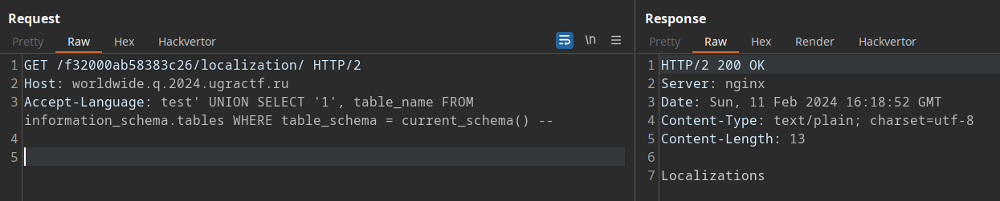

Существует таблица `Localizations`, в которой, видимо, и хранятся переведённые версии сайта. Вряд ли в ней есть что-то интересное, так что воспользуемся `OFFSET 1` для получения следующего результата.

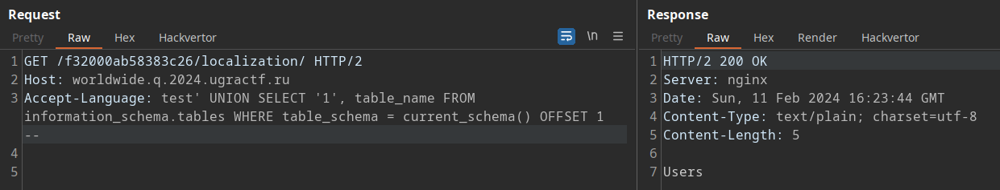

А вот это уже интересно! Сходим в `information_schema.columns`, чтобы узнать, какие столбцы есть в этой таблице. 

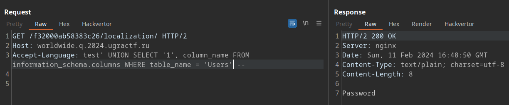

Отлично, с помощью `OFFSET` аналогичным образом получаем столбец `Username`. Кажется, дело за малым: достать логин и пароль из известной нам таблицы. Однако…

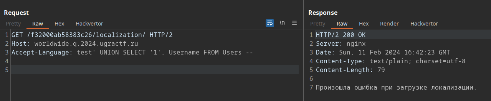

Ошибка. Это странно: таблица точно есть, столбец тоже, в схеме же всё написано! Так почему же происходит ошибка, как будто бы такой таблицы нет?

Как мы помним, используется СУБД PostgreSQL — имена таблиц и столбцов с использованием заглавных букв на самом деле не очень для неё характерны. Ведь обычно создание таблицы в PostgreSQL работает примерно так:

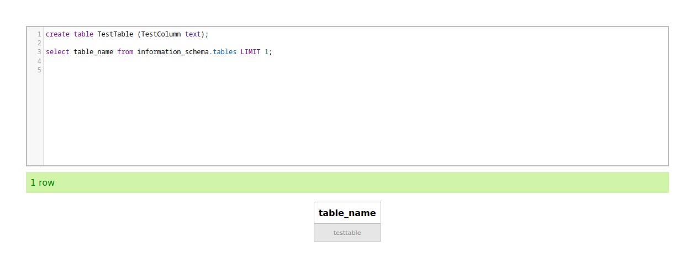

По умолчанию идентификаторы в PostgreSQL приводятся к нижнему регистру, но с нашими таблицами `Localizations` и `Users` этого не произошло. Как так вышло?

Идём в гугл с запросом в духе `postgresql uppercase names` и находим [ответ](https://stackoverflow.com/questions/43111996/why-postgresql-does-not-like-uppercase-table-names):

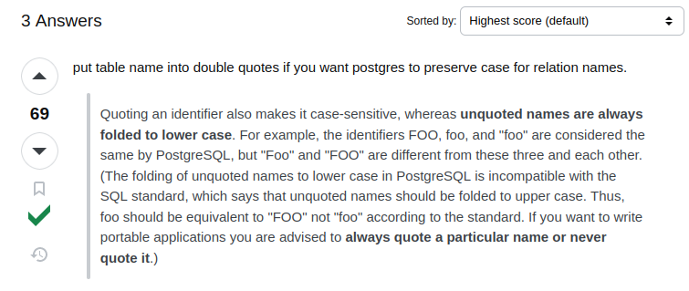

Итак, чтобы успешно извлечь логин и пароль, нужно обернуть имена столбцов и таблицы в двойные кавычки. Получаем такой запрос:

```
GET /f32000ab58383c26/localization/ HTTP/2
Host: worldwide.q.2024.ugractf.ru
Accept-Language: test' UNION SELECT '1', "Username"||' '||"Password" FROM "Users" --

```

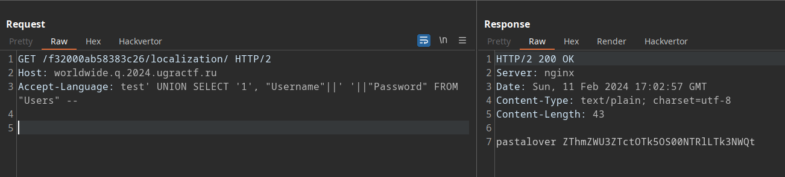

Вводим логин и пароль на сайте, после чего получаем промокод на экскурсию.


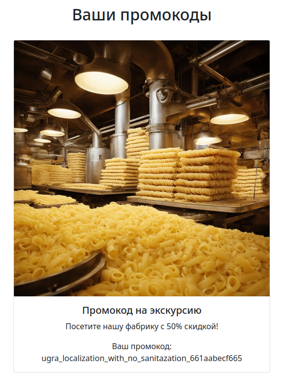

Флаг: **ugra_localization_with_no_sanitazation_661aabecf665**

## Альтернативное решение

Один из участников поделился решением, которое не требует решения проблем с двойными кавычками, а просто вызывает функцию PostgreSQL, сохраняющую содержимое целой БД в формате XML и запихивающей это огромное значение прямо в одно поле:

```
GET /f32000ab58383c26/localization/ HTTP/2
Host: worldwide.q.2024.ugractf.ru
Accept-Language: en-US' UNION SELECT '', database_to_xml(true,true,'')::text --

```

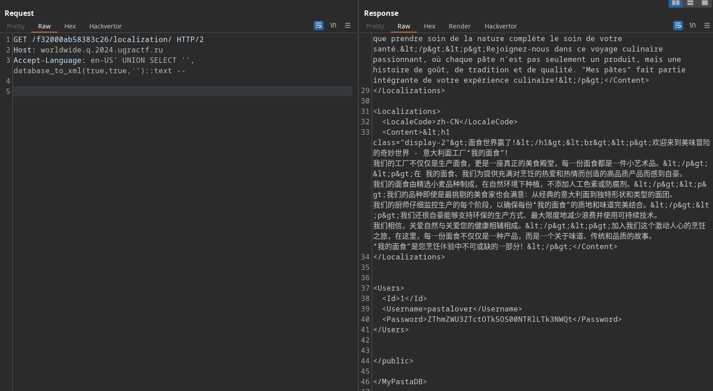

Элегантно!

## Постмортем

Изначально планировалось предоставлять исходники, но в ходе тестирования оказалось, что поиск вектора для инъекции оказался достаточно простым, чтобы этого не делать.

Однако из-за первоначального white-box-подхода к таску приложение было написано на C# и ASP.NET, чтобы у проекта была большая файловая структура, и поиск нужного места в коде занял какое-то время. Для хранения сущностей БД в приложении используется EntityFramework, а в качестве СУБД использовался SQL Server.

В ночь перед началом соревнований обнаружилось, что на сервере было обновлено ядро Linux, которое [полностью сломало контейнер с SQL Server](https://github.com/microsoft/mssql-docker/issues/868). Из-за этого таск пришлось экстренно переделывать под PostgreSQL, и при адаптации скрипта T-SQL имена столбцов и таблиц были заключены в двойные кавычки, так как иначе в приложении возникали ошибки при создании сущностей EF. Это сделало таск несколько сложнее, чем планировалось, и заслуживающим, наверное, большего количества баллов. Тем не менее, в итоге он оказался вполне решаемым.

Такие дела.
